# Donaria - Transparent Humanitarian Aid Platform

[](https://nextjs.org)
[](https://stellar.org)
[](https://firebase.google.com)

## Overview

Donaria is a revolutionary humanitarian aid platform that transforms how emergency relief reaches those in need. By leveraging blockchain technology and social verification, we create a direct bridge between verified donors and beneficiaries in crisis situations, eliminating intermediaries and ensuring maximum transparency.

### 🎯 Mission Statement

**"Building a bridge of trust between those who need help and those who can provide it."**

Donaria addresses critical challenges in humanitarian aid:
- **Lack of Transparency**: Traditional aid often lacks visibility into fund allocation
- **High Overhead Costs**: Multiple intermediaries reduce the impact of donations
- **Verification Issues**: Difficulty in verifying legitimate needs and beneficiaries
- **Slow Distribution**: Bureaucratic processes delay critical aid delivery
- **Geographic Barriers**: Cross-border donations face regulatory and technical hurdles

### 🌍 Global Impact Vision

Our platform serves diverse crisis scenarios:
- **Natural Disasters**: Earthquake, flood, hurricane, and wildfire relief
- **Medical Emergencies**: Life-saving treatments, surgeries, and medications
- **Educational Support**: School fees, supplies, and emergency student aid
- **Food Security**: Emergency nutrition and sustainable food programs
- **Refugee Assistance**: Immediate shelter, clothing, and basic necessities
- **Community Rebuilding**: Infrastructure repair and economic recovery

## 🚀 Revolutionary Wallet Architecture

Unlike traditional blockchain applications that require users to install wallet extensions and manage crypto tokens, Donaria features a completely different wallet architecture designed for mainstream adoption:

### Why Our Platform is More User-Friendly

**1. Superior User Experience**
- **No wallet installation required** - Users don't need to install browser wallet extensions like Freighter or Albedo
- **No gas fee management** - Users never need to buy or manage FLR/SGB tokens for transaction fees
- **Familiar social login flow** - Seamless onboarding through social providers users already know and trust

**2. Developer Control & Reliability**
- **Controlled transaction flow** - We manage the entire transaction experience and user feedback
- **Custom business logic** - Can implement sophisticated logic around transactions and user interactions
- **Better error handling** - Comprehensive error management with user-friendly messaging

**3. Mainstream Adoption Focus**
- **Works for crypto newcomers** - Perfect for users who know nothing about blockchain or cryptocurrency
- **Removes crypto barriers** - Social login eliminates the complexity of private key management
- **Gasless interactions** - Users can donate and create reports without any blockchain knowledge

### Technical Implementation

**App-Managed Wallets**
- Platform creates and securely manages Stellar keypairs for users
- Private keys encrypted and stored server-side with enterprise-grade security
- Users interact through our intuitive UI, not complex wallet interfaces

**Gasless Transactions (App-Sponsored)**
- Our funding account automatically pays all transaction fees
- Users experience instant, free interactions with the blockchain
- Fallback to user-paid transactions available for advanced users who prefer it

**Social Login Integration**
- Seamless onboarding through familiar social providers
- Lower barrier to entry compared to traditional crypto wallets
- Maintains security while dramatically improving accessibility

This architecture makes Donaria accessible to everyone, not just crypto enthusiasts, while maintaining all the benefits of blockchain transparency and security.

### 🌟 Key Features

#### 🔐 Trust & Transparency
- **Immutable Records**: All donations permanently recorded on Stellar blockchain
- **Public Verification**: Anyone can verify transactions via blockchain explorers
- **Zero Hidden Fees**: Complete visibility into all platform costs and transactions
- **Audit Trail**: Full history from donation initiation to beneficiary receipt

#### 🚀 User Experience
- **One-Click Social Login**: Google, X (Twitter), Instagram, email, or phone authentication
- **Instant Wallet Creation**: Automated Stellar wallet generation with PIN security
- **Auto-Funding**: New users receive 1 XLM to start participating immediately
- **Mobile-First Design**: Responsive interface optimized for all devices
- **Multi-Language Support**: Accessible to global communities (coming soon)

#### 💰 Financial Innovation
- **Gasless Transactions**: Users never pay blockchain fees - all covered by the platform
- **Micro-Donations**: Support causes with as little as $0.01 equivalent
- **Cross-Border Payments**: Send aid anywhere in seconds, not days
- **Zero User Fees**: Platform sponsors all blockchain transaction costs
- **Real-Time Settlement**: Instant delivery to beneficiary wallets
- **Multi-Currency Support**: XLM, USDC, and other Stellar assets

#### 🛡️ Security & Privacy
- **PIN-Based Encryption**: Private keys encrypted locally with user-controlled PINs
- **Non-Custodial**: Users maintain full control of their funds
- **Identity Verification**: Multi-step beneficiary verification process
- **Fraud Prevention**: Smart contract-based validation and community reporting
- **GDPR Compliant**: Privacy-first data handling and user rights protection

## Technology Stack

### Frontend
- **Next.js 15** with App Router
- **React 19** with TypeScript
- **TailwindCSS** + ShadCN UI components
- **Stellar SDK** for blockchain operations

### Backend & Services
- **Firebase Authentication** (Google, Twitter, Instagram, Email, Phone)
- **Firebase Firestore** for user data and metadata
- **Firebase Storage** for image and document uploads
- **Soroban Smart Contracts** for transparent need reports on Stellar
- **Stellar Network** (Testnet/Mainnet) for gasless transactions
- **CryptoJS** for client-side encryption

### Smart Contract System
- **Need Reports Contract**: Transparent CRUD operations for humanitarian needs
- **Change Logging**: Immutable audit trail for all report modifications
- **Admin Controls**: Verification and status management system
- **Statistics Tracking**: Real-time platform metrics and analytics
- **App-Sponsored Transactions**: Zero gas fees for users

### Key Security Features
- PIN-based private key encryption
- App-sponsored gasless transactions
- Firebase Admin SDK for secure operations
- Smart contract transparency and immutability
- Client-side wallet management with full user control

## Architecture


## Donation Workflow


## Smart Contract Need Management Workflow

```mermaid
sequenceDiagram
    participant B as Beneficiary
    participant DA as Donaria App
    participant FB as Firebase Storage
    participant SC as Smart Contract
    participant FW as Funding Wallet
    participant ST as Stellar Network
    participant D as Donors
    
    Note over B,D: Gasless Need Creation
    B->>DA: Social Login (Google/X/Instagram)
    DA->>DA: Auto-Generate Wallet + PIN
    DA->>FW: Fund User Wallet (1 XLM)
    
    B->>DA: Create Need Request Form
    B->>DA: Upload Evidence Images
    DA->>FB: Store Images with Report ID
    FB-->>DA: Return Image URLs
    
    Note over B,D: Smart Contract Deployment
    DA->>FW: Use Platform Wallet for Gas
    FW->>SC: Create Need Report (Gasless for User)
    SC->>SC: Generate Unique Report ID
    SC->>SC: Store: Title, Description, Location, Category, Amount, Images
    SC->>SC: Log: Creation Event with Timestamp
    SC-->>DA: Return Report ID
    DA-->>B: Need Published (ID: 1)
    
    Note over B,D: Transparent Discovery
    D->>DA: Browse Needs
    DA->>SC: Query Active Reports
    SC-->>DA: Return Verified Reports + Stats
    DA-->>D: Display: Title, Progress, Images, Verification Status
    
    Note over B,D: Real-Time Updates
    D->>ST: Send Donation to Beneficiary
    ST->>B: Funds Received
    
    Note over B,D: Admin Verification (Gasless)
    DA->>FW: Admin Wallet Signs
    FW->>SC: Update Status (pending → verified)
    SC->>SC: Log: Status Change + Admin Notes
    SC-->>DA: Verification Complete
    DA->>B: Notify: Need Verified
    DA->>D: Notify: Ready for Donations
    
    Note over B,D: Immutable Transparency
    D->>DA: Check Impact & History
    DA->>SC: Get Change Log for Report
    SC-->>DA: Return: All Changes + Timestamps + Actors
    DA->>SC: Get Platform Statistics
    SC-->>DA: Return: Total Reports, Amounts, Status Distribution
    DA-->>D: Show: Complete Audit Trail
    
    Note over B,D: Zero-Fee Updates
    B->>DA: Update Need Information
    DA->>FW: Platform Sponsors Gas
    FW->>SC: Update Report (with Change Reason)
    SC->>SC: Log: Field Changes + Old/New Values
    SC-->>DA: Update Successful
    DA-->>B: Changes Saved to Blockchain
```



## 🚀 Gasless Transaction System

### How App-Sponsored Transactions Work

Donaria implements a revolutionary **gasless transaction system** where users never pay blockchain fees, making humanitarian aid accessible to everyone regardless of their cryptocurrency knowledge or financial capacity.

#### 🔐 **Technical Implementation**


#### 💡 **Key Benefits**

**For Beneficiaries:**
- ✅ **Zero Barrier Entry**: Create need reports without owning cryptocurrency
- ✅ **Immediate Access**: Start using the platform instantly after social login
- ✅ **Focus on Need**: Concentrate on humanitarian crisis, not technical complexity
- ✅ **Global Accessibility**: Available worldwide without local crypto infrastructure

**For Donors:**
- ✅ **Simplified Giving**: Donate without understanding blockchain fees
- ✅ **Maximum Impact**: 100% of donation reaches beneficiaries
- ✅ **Trust & Transparency**: All transactions publicly verifiable on blockchain
- ✅ **Micro-Donations**: Support causes with any amount, no minimum fees

**For the Platform:**
- ✅ **Predictable Costs**: Fixed operational expenses for transaction processing
- ✅ **User Retention**: Eliminate friction that causes user drop-off
- ✅ **Scalable Model**: Sustainable economics as user base grows
- ✅ **Regulatory Compliance**: Simplified compliance without user-to-user crypto transfers

#### 🔧 **Security Model**

```typescript
// User Authentication: Private key proves ownership
const userAuth = {
  privateKey: userPrivateKey,  // User controls identity
  authorization: true          // User approves action
}

// App Sponsorship: Platform wallet pays fees
const appSponsorship = {
  fundingWallet: STELLAR_FUNDING_SECRET,  // Platform pays gas
  gasless: true,                          // User pays nothing
  control: 'platform'                     // App manages costs
}

// Result: User-controlled + Platform-sponsored
const transaction = {
  creator: userPublicKey,      // User owns the action
  sponsor: platformWallet,     // Platform pays the fees
  immutable: true,            // Permanently recorded
  transparent: true           // Publicly verifiable
}
```

#### 📊 **Economic Sustainability**

**Cost Structure:**
- **Average Transaction Cost**: ~$0.00001 USD per smart contract call
- **Daily Volume Estimate**: 1,000 need reports + 5,000 updates = ~$0.06/day
- **Monthly Operating Cost**: ~$1.80 for transaction fees
- **Annual Blockchain Costs**: ~$22 for unlimited humanitarian aid operations

**Revenue Model:**
- Optional platform fees on large donations (>$1,000)
- Premium features for institutional donors
- API access for humanitarian organizations
- Partnership revenue with verified aid organizations

This gasless system removes the **biggest barrier** to blockchain adoption in humanitarian aid: the requirement to understand and pay transaction fees. Users focus on what matters - helping others or getting help - while the platform handles all technical complexity.

## 📋 Smart Contract Integration

### Contract Details
- **Contract Address**: `CBJVRBD5TCCM3BF22NDZPBSMU7VON5LQZBQOW3HMTN3PFDWD2TLW34XW`
- **Network**: Stellar Testnet (soon Mainnet)
- **Language**: Rust (Soroban)
- **Features**: CRUD operations, change logging, admin controls, statistics

### Live Contract Statistics
```json
{
  "total_reports": 1,
  "pending_reports": 1,
  "verified_reports": 0,
  "funded_reports": 0,
  "completed_reports": 0,
  "total_amount_needed": 5000,
  "total_amount_raised": 0
}
```

### Transparency Features
- **Immutable Records**: All need reports permanently stored on blockchain
- **Change Logging**: Every modification tracked with timestamp and reason
- **Public Verification**: Anyone can verify data using blockchain explorers
- **Admin Controls**: Transparent verification and status update system
- **Real-time Statistics**: Live platform metrics available to all users

## Getting Started

### Prerequisites

- Node.js 18+ and npm
- Firebase project with Authentication and Firestore enabled
- Stellar account for funding operations
- Environment variables configured

### Installation

1. **Clone the repository**
   ```bash
   git clone <repository-url>
   cd Donaria
   ```

2. **Install dependencies**
   ```bash
   npm install
   ```

3. **Configure environment variables**
   Create `.env.local` with:
   ```env
   # Firebase Configuration
   NEXT_PUBLIC_FIREBASE_API_KEY=your_api_key
   NEXT_PUBLIC_FIREBASE_AUTH_DOMAIN=your_project.firebaseapp.com
   NEXT_PUBLIC_FIREBASE_PROJECT_ID=your_project_id
   NEXT_PUBLIC_FIREBASE_STORAGE_BUCKET=your_project.appspot.com
   NEXT_PUBLIC_FIREBASE_MESSAGING_SENDER_ID=your_sender_id
   NEXT_PUBLIC_FIREBASE_APP_ID=your_app_id
   NEXT_PUBLIC_FIREBASE_MEASUREMENT_ID=your_measurement_id
   
   # Firebase Admin (Server-side)
   FIREBASE_ADMIN_PRIVATE_KEY=your_admin_private_key
   FIREBASE_ADMIN_CLIENT_EMAIL=your_admin_email
   FIREBASE_ADMIN_PROJECT_ID=your_project_id
   
   # Stellar Configuration
   NEXT_PUBLIC_STELLAR_NETWORK=testnet
   STELLAR_FUNDING_SECRET=your_funding_account_secret
   
   # Smart Contract Configuration
   NEED_REPORTS_CONTRACT_ID=your_deployed_contract_id
   
   # Social Authentication
   INSTAGRAM_CLIENT_ID=your_instagram_client_id
   INSTAGRAM_CLIENT_SECRET=your_instagram_client_secret
   NEXT_PUBLIC_APP_URL=https://www.donaria.xyz
   ```

4. **Run the development server**
   ```bash
   npm run dev
   ```

5. **Deploy Smart Contract (Optional for Development)**
   ```bash
   cd contracts-soroban/need-reports/contracts/need-reports
   make build           # Build the smart contract
   make fund-alice      # Fund deployer account
   make deploy-testnet  # Deploy to Stellar testnet
   ```

6. **Open your browser**
   Navigate to [http://localhost:3000](http://localhost:3000)

### Available Scripts

```bash
npm run dev          # Start development server
npm run build        # Build for production
npm run start        # Start production server
npm run lint         # Run ESLint checks

# Smart Contract Commands
cd contracts-soroban/need-reports/contracts/need-reports
make build           # Build Rust smart contract
make test            # Run contract tests
make deploy-testnet  # Deploy to Stellar testnet
make fund-alice      # Fund deployment account
```

### Smart Contract Development

The platform includes a complete Soroban smart contract system for transparent need management:

```bash
# Navigate to smart contract directory
cd contracts-soroban/need-reports/contracts/need-reports

# Build the contract
make build

# Run tests
cargo test

# Deploy to testnet
make setup-network    # Setup Stellar testnet
make fund-alice      # Fund deployment account
make deploy-testnet  # Deploy contract

# Test contract functions
stellar contract invoke --id CONTRACT_ID --source alice --network testnet -- get_stats
```

## User Roles & Capabilities

### 🤝 Donors - "Be the Change"

**Discovery & Research**
- Browse verified emergency needs with detailed stories and documentation
- Filter by crisis type, location, urgency level, and funding progress
- View beneficiary verification status and community endorsements
- Access impact reports from previously funded campaigns

**Donation Process**
- Contribute any amount starting from $0.01 equivalent
- Choose between one-time donations or recurring monthly support
- Add personal messages of encouragement to beneficiaries
- Donate anonymously or publicly with profile attribution

**Impact Tracking**
- Real-time updates on how funds are being used
- Photo and video updates from beneficiaries showing progress
- Blockchain-verified transaction history with timestamps
- Community feedback and testimonials from recipients
- Tax-deductible receipt generation (where applicable)

**Community Engagement**
- Join donor circles for coordinated giving campaigns
- Share successful stories on social media to amplify reach
- Participate in platform governance and feature voting
- Access exclusive donor events and impact webinars

### 🙏 Beneficiaries - "Share Your Story"

**Need Registration**
- Create detailed emergency requests with photos and documentation
- Submit identity verification through government ID or community endorsement
- Set funding goals with transparent breakdown of expenses
- Categorize needs (medical, education, disaster relief, etc.)

**Documentation & Verification**
- Upload supporting documents (medical bills, school fees, damage assessments)
- Provide emergency contact information and location details
- Complete identity verification through multi-step process
- Obtain community endorsements from local leaders or organizations

**Fund Management**
- Receive donations directly to personal Stellar wallet
- Convert received XLM/USDC to local currency via partner exchanges
- Track funding progress with visual indicators and milestones
- Access emergency disbursement for urgent medical situations

**Community Reporting**
- Provide regular updates on how donations are being used
- Share photos and videos showing progress and impact
- Send thank-you messages to donors and supporters
- Report completion of funded goals with final documentation

### 🏛️ Platform Governance

**Community Moderation**
- Volunteer moderators review and verify beneficiary requests
- Community voting on disputed cases and policy changes
- Transparent appeals process for rejected applications
- Regular platform updates based on user feedback

**Trust & Safety**
- Machine learning algorithms detect potential fraud patterns
- Community reporting system for suspicious activities
- Regular audits of high-value transactions and beneficiaries
- Partnership with local verification organizations globally

## Security & Trust Framework

### 🔐 Technical Security

**Blockchain Foundation**
- **Immutable Ledger**: All transactions permanently recorded on Stellar network
- **Public Verification**: Anyone can verify donations using blockchain explorers
- **Decentralized Network**: No single point of failure or control
- **Smart Contract Validation**: Automated verification of transaction parameters

**Wallet Security**
- **Non-Custodial Architecture**: Users control their private keys at all times
- **PIN-Based Encryption**: AES-256 encryption with user-generated PINs
- **Local Key Storage**: Private keys never transmitted or stored on servers
- **Backup & Recovery**: Secure seed phrase generation for wallet restoration

**Data Protection**
- **GDPR Compliance**: Full compliance with European data protection regulations
- **End-to-End Encryption**: Sensitive communications encrypted in transit
- **Minimal Data Collection**: Only essential information stored
- **Right to be Forgotten**: Complete data deletion on user request

### 🛡️ Trust & Verification

**Beneficiary Verification**
- **Multi-Step Identity Verification**: Government ID, phone, and document verification
- **Community Endorsement**: Local leaders and organizations can vouch for beneficiaries
- **Geo-Location Verification**: GPS and address confirmation for emergency situations
- **Social Media Cross-Reference**: Optional social media account verification

**Community Trust Building**
- **Reputation System**: Track record of successful donations and beneficiary outcomes
- **Peer Review Process**: Community members can review and rate beneficiary requests
- **Transparency Reports**: Regular publication of platform statistics and outcomes
- **Impact Verification**: Third-party validation of funded project outcomes

### ⚖️ Regulatory Compliance

**Financial Regulations**
- **AML/KYC Compliance**: Anti-money laundering and know-your-customer procedures
- **Cross-Border Compliance**: Adherence to international remittance regulations
- **Tax Reporting**: Integration with tax reporting systems where required
- **Sanctions Screening**: Automated screening against global sanctions lists

**Platform Governance**
- **Terms of Service**: Clear guidelines for platform usage and acceptable behavior
- **Dispute Resolution**: Fair and transparent process for handling conflicts
- **Appeal Mechanisms**: Multi-tier appeal process for beneficiary application rejections
- **Community Guidelines**: Standards for appropriate content and behavior

### 📊 Risk Management

**Fraud Prevention**
- **AI-Powered Detection**: Machine learning algorithms identify suspicious patterns
- **Transaction Monitoring**: Real-time analysis of donation flows and beneficiary behavior
- **Community Reporting**: Easy reporting mechanisms for suspicious activities
- **Rapid Response Team**: 24/7 team for handling security incidents and fraud reports

**Financial Risk Mitigation**
- **Multi-Signature Controls**: Critical operations require multiple approvals
- **Rate Limiting**: Protection against donation manipulation and spam
- **Insurance Coverage**: Platform insurance for technical failures and security breaches
- **Emergency Funds**: Reserve funds for critical security incidents and beneficiary emergencies

## Contributing

We welcome contributions to make humanitarian aid more transparent and accessible. Please read our contributing guidelines and submit pull requests for improvements.

## License

This project is licensed under the MIT License - see the LICENSE file for details.

## Live Platform

🌐 **Visit Donaria**: [https://www.donaria.xyz](https://www.donaria.xyz)

## Support

For support and questions:
- 📧 Email: support@donaria.xyz
- 💬 Discord: [Join our community]
- 📖 Documentation: [docs.donaria.xyz]

---

**Building a bridge of trust between those who need help and those who can provide it.** 🌍❤️